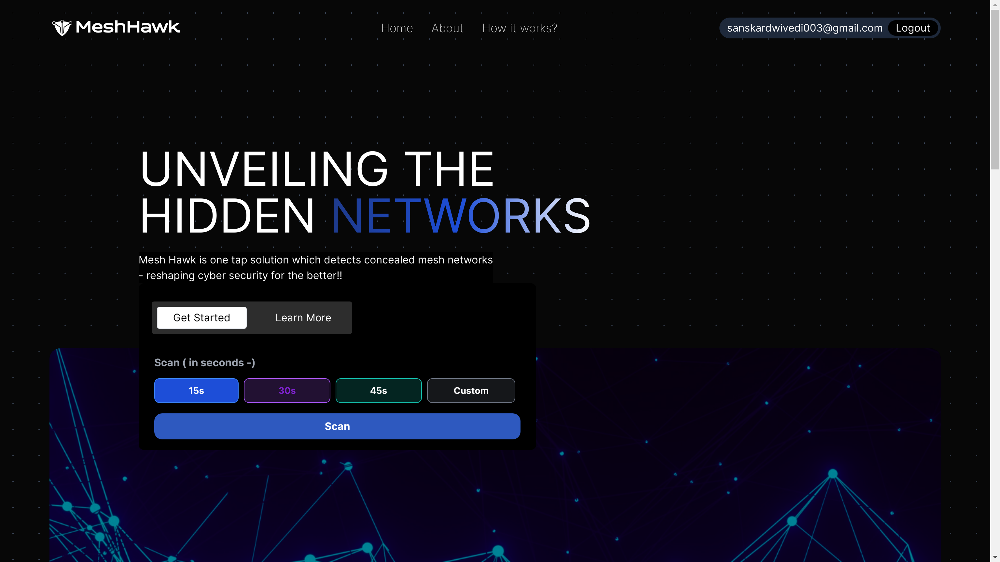
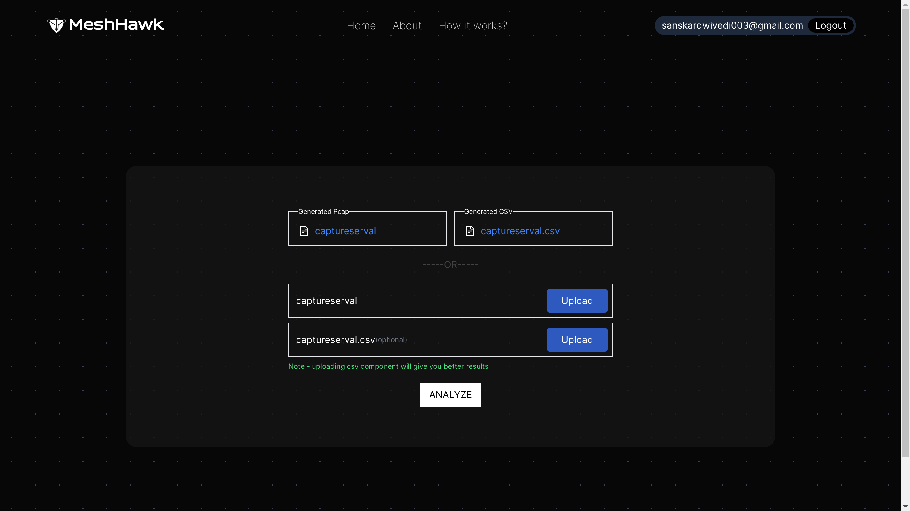
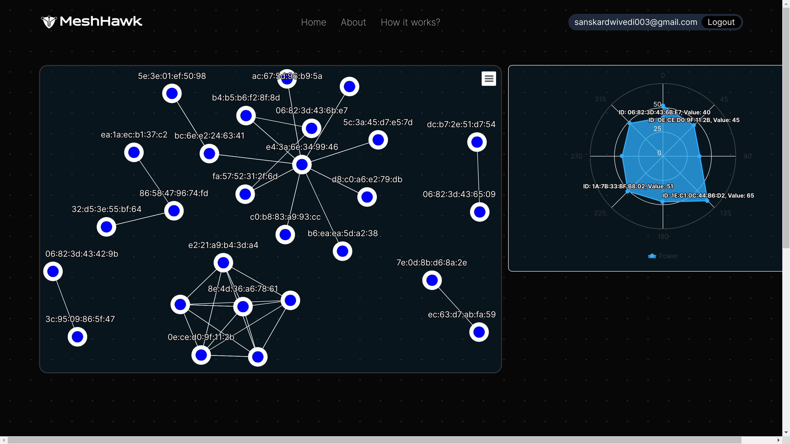
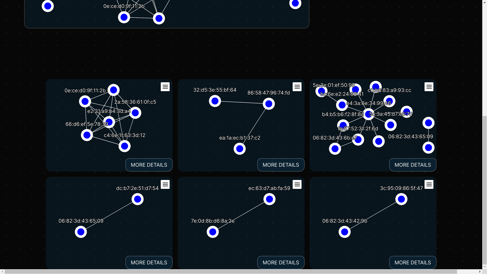
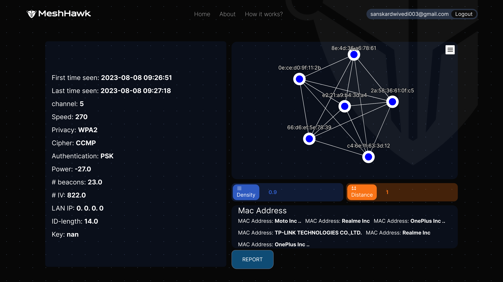
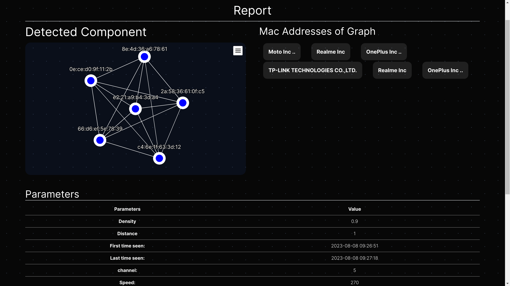

# MeshHawk



## Overview

MeshHawk is a web application built on React and FASTApi designed for scanning and detecting potential mesh networks in a given area. Leveraging monitor mode, MeshHawk scans packets, extracts details, and uploads the information to a server (FASTApi) for in-depth analysis. Users also have the option to upload previously captured CSV and PCAPNG files for analysis without rescanning. Once a mesh network is identified, users can access detailed information about connected devices within the network.

## Features

- **Mesh Network Scanning:** Utilize monitor mode to scan packets and detect potential mesh networks.
- **Packet Details:** Capture and upload packet details to the server for comprehensive analysis.
- **File Upload:** Allow users to upload previously captured CSV and PCAPNG files for analysis.
- **Network Insights:** Access detailed information about connected devices within the identified mesh network.

## Clone, Install and Run

Ensure you have the latest versions of Node.js and Python installed on your machine. Also, make sure to install tshark from wireshark website inorder for analysis purpose.

```bash
git clone https://github.com/Akshat-Pandey16/MeshHawk
cd MeshHawk
npm start
```

## Usage

1. **Scanning:**
   - Launch MeshHawk.
   - Initiate scanning in monitor mode.
   - View real-time scanning progress.
   - 

2. **File Upload:**
   - Select the option to upload CSV or PCAPNG files.
   - Analyze previously captured data without rescanning.
   - 

3. **Network Details:**
   - Explore detailed information about the identified mesh network.
   - Access device names and other relevant insights.
   - 
   - 
   
4. **More Details and Report Generation** 
   - 
   - 


**To stop server, press Ctrl+C**

This will perform the following steps:

1.  **Start FastAPI Server:**
    
    - The script will initiate the FastAPI server, ensuring it's running and ready for incoming connections.

2.  **Install Dependencies:**
    
    - Automatically installs the required dependencies for both the FastAPI backend and the React frontend.

3.  **Run React Server:**
    
    - Launches the React development server.
    - The application will be accessible at [http://localhost:5173](http://localhost:5173).

4. **SSH Configuration:**

   - The server communicates with the scanning device via SSH.
   - If you need to change the IP address or password for the SSH device, make the necessary modifications in the scripts located at Backend/scripts/.

## Contributors

[Akshat Pandey](https://github.com/Akshat-Pandey16) <br>
[Sanskar Dwivedi](https://github.com/Knighthawk-Leo) <br>
[Yash Sakre](https://github.com/Yash-Sakre) <br>
[Ranjit Ranjan](https://github.com/ranjit7858)<br>
[Jayash Tripathi](https://github.com/JayashTripathy)<br>
[Poorva Diwan](https://github.com/poorvadiwan)<br>


## Contribution
Feel free to contribute by opening issues, proposing new features, or submitting pull requests. We welcome your feedback and collaboration.